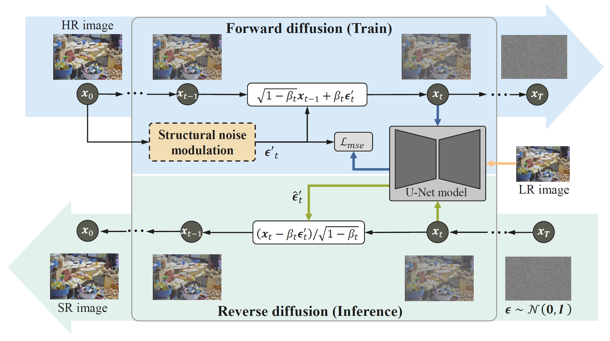
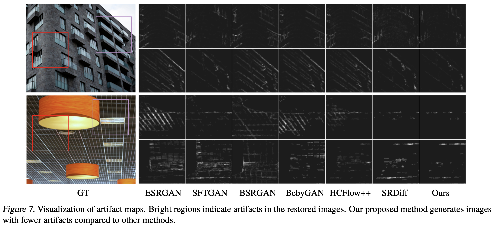

# SAM-DiffSR: Structure-Modulated Diffusion Model for Image Super-Resolution

This is the official implementation of the
paper "[SAM-DiffSR: Structure-Modulated Diffusion Model for Image Super-Resolution](https://arxiv.org/abs/2402.17133)".

<div align=center>
    
</div>

## Abstract

Conventional diffusion models perform noise sampling from a single distribution,
constraining their ability to handle real-world scenes and complex textures across semantic regions. With the success of
segment anything model (SAM), generating sufficiently fine-grained region masks can enhance the detail recovery of
diffusion-based SR model. However, directly integrating SAM into SR models will result in much higher computational
cost. We propose the SAM-DiffSR model, which can utilize the fine-grained structure information from SAM
in the process of sampling noise to improve the image quality without additional computational cost during inference. In
the process of training, we encode structural position information into the segmentation mask from SAM. Then the encoded
mask is integrated into the forward diffusion process by modulating it to the sampled noise. This adjustment allows us
to independently adapt the noise mean within each corresponding segmentation area. The diffusion model is trained to
estimate this modulated noise. Crucially, our proposed framework does NOT change the reverse diffusion process and does
NOT require SAM at inference.

## Result

| SamDiff  | Set5   | Set14  | Urban100 | BSDS100 | Manga109 | General100 | DIV2K  |
|----------|--------|--------|----------|---------|----------|------------|--------|
| **PSNR** | 30.99  | 27.14  | 25.54    | 26.47   | 29.43    | 30.30      | 29.34  |
| **SSIM** | 0.8731 | 0.7484 | 0.7721   | 0.7003  | 0.8899   | 0.8353     | 0.8109 |
| **FID**  | 48.20  | 49.84  | 4.5276   | 60.81   | 2.3994   | 38.42      | 0.3809 |

<div align=center>
    
</div>

<div align=center>
    
</div>

## Data and Checkpoint

| info                                            | link                                                                                                                                                                |
|-------------------------------------------------|---------------------------------------------------------------------------------------------------------------------------------------------------------------------|
| segment mask data in RLE format generate by sam | [CowTransfer](https://cowtransfer.com/s/46a894c9f9f949) or [Google Driver](https://drive.google.com/drive/folders/11RqPtfEa36eY1YpJwbF-nyHf1InjI1qR?usp=share_link) |
| embedde d mask in npy format generate by SPE    | [CowTransfer](https://cowtransfer.com/s/46a894c9f9f949) or [Google Driver](https://drive.google.com/drive/folders/11RqPtfEa36eY1YpJwbF-nyHf1InjI1qR?usp=share_link) |
| model checkpoint                                | [CowTransfer](https://cowtransfer.com/s/a671fa553a4d44) or [Google Driver](https://drive.google.com/drive/folders/1rVvEQ3uJu6sDUvqnEjKICi74u_rdo01L?usp=share_link) |

## Environment Installation

```bash
pip install -r requirements.txt
```

## Dataset Preparation

### Training dataset

1. To download DF2K and DIV2K validation

   Make the data tree like this

   ```
   data/sr
   ├── DF2K
   │   └── DF2K_train_HR
   │       ├── 0002.png
   │       ├── 0003.png
   │       ├── 0001.png
   |       ├── ...
   └── DIV2K
       └── DIV2K_valid_HR
           ├── 0002.png
           ├── 0003.png
           ├── 0001.png
           ├── ...
   ```


2. Generate sam mask

    - Use processed data:

      Download the mask data from [CowTransfer](https://cowtransfer.com/s/46a894c9f9f949)
      or [Google Driver](https://drive.google.com/drive/folders/11RqPtfEa36eY1YpJwbF-nyHf1InjI1qR?usp=share_link).

    - Or, generate data from scratch

        1. download [segment-anything](https://github.com/facebookresearch/segment-anything) code, and download the *
           *`vit_h`** checkpoint.

           ```shell
           git clone https://github.com/facebookresearch/segment-anything.git
           ```

        2. generate mask data in RLE format by sam

              ```shell
              python scripts/amg.py \
              --checkpoint weights/sam_vit_h_4b8939.pth \
              --model-type vit_h \
              --input data/sr/DF2K/DF2K_train_HR \
              --output data/sam_out/DF2K/DF2K_train_HR \
              --convert-to-rle
              ```

        3. use SPE to embedded the RLE format mask

              ```shell
              python scripts/merge_mask_to_one.py \
              --input data/sam_out/DF2K/DF2K_train_HR \
              --output data/sam_embed/DF2K/DF2K_train_HR
              ```

3. build bin dataset

   ```shell
   python data_gen/df2k.py --config configs/data/df2k4x_sam.yaml
   ```

### Benchmark dataset

1. download the dataset. e.g Set5, Set14, Urban100, Manga109, BSDS100

2. change the `data_name` and `data_path` in `data_gen/benchmark.py`, and run:

   ```
   python data_gen/benchmark.py --config configs/data/df2k4x_sam.yaml
   ```

## Training

1. download rrdb pretrain model from [CowTransfer](https://cowtransfer.com/s/a671fa553a4d44)
   or [Google Driver](https://drive.google.com/drive/folders/1rVvEQ3uJu6sDUvqnEjKICi74u_rdo01L?usp=share_link), and move
   the weight to `./weights/rrdb_div2k.ckpt`

2. train diffusion model

   ```shell
   python tasks/trainer.py \
   --config configs/sam/sam_diffsr_df2k4x.yaml \
   --exp_name sam_diffsr_df2k4x \
   --reset \
   --hparams="rrdb_ckpt=weights/rrdb_div2k.ckpt" \
   --work_dir exp/
   ```

## Evaluation

- evaluate specified checkpoint (like 400000 steps)

  ```shell
  python tasks/trainer.py 
  --benchmark \
  --hparams="test_save_png=True" \
  --exp_name sam_diffsr_df2k4x \
  --val_steps 400000 \
  --benchmark_name_list test_Set5 test_Set14 test_Urban100 test_Manga109 test_BSDS100
  ```

  If you want to replicate our results, you should download the checkpoint and move it
  to `SAM-DiffSR/checkpoints/sam_diffsr_df2k4x` directory.

- evaluate all checkpoint

  ```shell
  python tasks/trainer.py \
  --benchmark_loop \
  --exp_name sam_diffsr_df2k4x \
  --benchmark_name_list test_Set5 test_Set14 \
  ```

## Inference

```shell
python tasks/infer.py \
--config configs/sam/sam_diffsr_df2k4x.yaml \
--img_dir your/lr/img/path \
--save_dir your/sr/img/save/path \
--ckpt_path model_ckpt_steps_400000.ckpt
```

## Citation

If you find this project useful in your research, please consider cite:

```bibtex
@article{wang2024sam,
  title={SAM-DiffSR: Structure-Modulated Diffusion Model for Image Super-Resolution},
  author={Wang, Chengcheng and Hao, Zhiwei and Tang, Yehui and Guo, Jianyuan and Yang, Yujie and Han, Kai and Wang, Yunhe},
  journal={arXiv preprint arXiv:2402.17133},
  year={2024}
}
```


## Acknowledgement

The implementation is based on [LeiaLi/SRDiff](https://github.com/LeiaLi/SRDiff). Thanks for their open source code.
